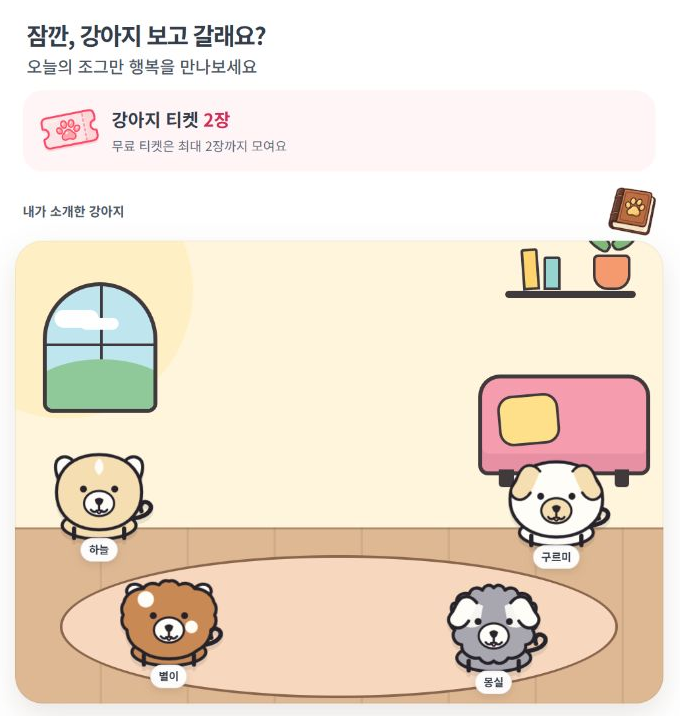
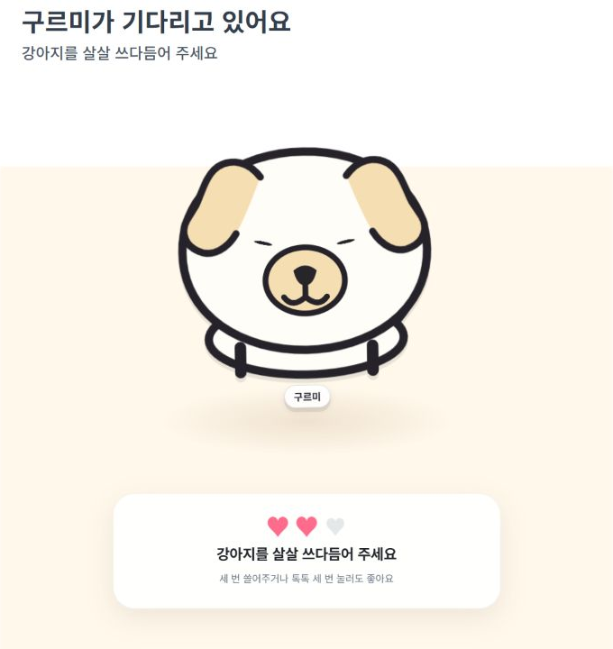
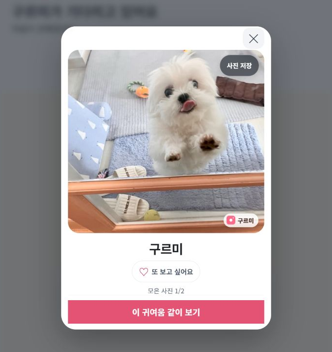
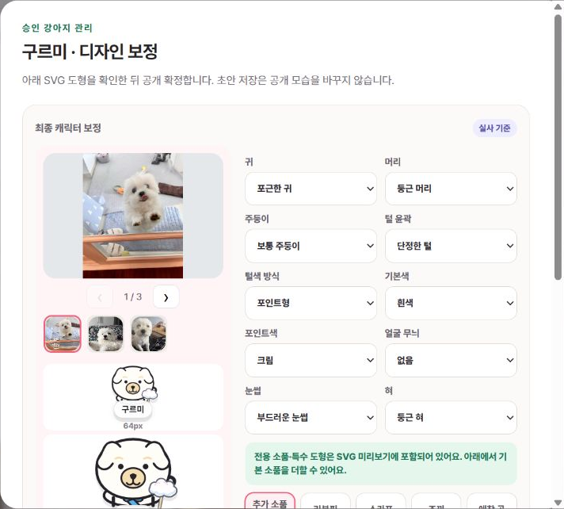

# 옆집 강아지 🐶

> **귀엽기만 해도 되나요?**

간식을 주고 세 번 쓰다듬으면, 캐릭터 너머 실제 강아지를 만나는 **React·TypeScript 기반 앱인토스 미니앱**입니다. 매일 만나는 이웃을 고르고, 좋아하는 사진은 앨범에 모아 다시 볼 수 있습니다.

짧은 교감을 제공하는 서비스에서 출발해, 개별 강아지 검수와 사진 수집·공유가 추가되면서 설계도 바뀌었습니다. **검수한 외형을 그대로 전달하는 일, 과거 만남을 새 앨범으로 옮기는 일, 외부 앱에서 막힌 진입을 이어 주는 일, 화면을 떠난 뒤 완료된 요청을 반영하는 일**을 중심으로 설계 결정을 정리했습니다.

[웹 데모](https://cute-enough.vercel.app) · [화면 보기](#화면으로-보기) · [설계에서 고민한 부분](#설계에서-고민한-부분) · [기술 스택](#기술-스택) · [실행하기](#실행하기)

## 화면으로 보기

**오늘의 집 → 간식 → 쓰다듬기·터치 → 실제 사진 → 앨범·공유**

<table>
  <tr>
    <th>오늘의 집</th>
    <th>쓰다듬기·터치</th>
    <th>실제 사진 만나기</th>
  </tr>
  <tr>
    <td></td>
    <td></td>
    <td></td>
  </tr>
  <tr>
    <td>오늘 만난 친구를 다시 찾아요.</td>
    <td>한 번의 교감마다 반응이 돌아와요.</td>
    <td>마음에 든 사진을 모으고 공유해요.</td>
  </tr>
</table>

웹 데모와 앱 캡처는 샘플 데이터로 동작하는 preview입니다. Toss 연동 기능은 기기 QR에서 별도로 검증합니다.

<details>
<summary>현재 서비스 규칙</summary>

| 경험 | 규칙 |
| --- | --- |
| 오늘의 집 | 사용자·KST 날짜별 공개 4마리 고정 + 내 최신 검수 중·승인 강아지 1마리 |
| 무료 티켓 | 최대 2장, 사용 후 3시간마다 1장 충전. 자정에도 잔액 유지 |
| 사진 수집 | 사용자·강아지별 KST 하루 한 장. 모은 사진의 재열람과 내 사진은 무료 |
| 다시 만나기 | 홈에서는 교감 후 사진 보기, 앨범·내 강아지 목록에서는 사진 바로 보기 |
| 추가 만남 | 티켓이 없을 때 광고 선택 가능. 친구 초대 보너스는 무료 티켓과 별도 보관 |
| 등록과 공개 | 사진·꾸미기 → 제작자 검수 → 공개. 검수 전 실사는 업로더만 접근 |

</details>

## 핵심 설계 결정

기능을 추가할 때마다 기존 경험을 어디까지 보존할지 결정해야 했습니다. 앱 내부의 데이터뿐 아니라, **외부 앱에서 들어오거나 요청 도중 화면을 떠나는 순간**도 서비스의 일부로 다뤘습니다.

| 바뀐 요구 | 다시 정해야 했던 기준 |
| --- | --- |
| 제작자가 강아지마다 외형을 직접 보정 | 공개 외형의 원본은 설정값인가, 검수한 도형인가? |
| 한 번 본 사진을 앨범에 보관 | 강아지별 만남 기록을 사진별 접근권으로 어떻게 전환할까? |
| 설치된 Toss가 네이버에서는 앱스토어로 연결 | 앱 전환 실패를 미설치로 단정하지 않고 진입을 이어 줄 수 있을까? |
| 화면 이동 중에도 요청이 계속 완료 | 화면을 닫은 의도와 서버에서 확정된 결과를 어떻게 함께 지킬까? |

## 설계에서 고민한 부분

### 1. 검수에서 고친 외형을 앱 배포 없이 그대로 보여줄 수 있을까?

처음에는 귀·털색·소품 같은 설정으로 캐릭터를 그렸습니다. 제작자가 강아지마다 작은 장식과 도형을 추가하면서, **같은 설정만으로는 검수한 외형을 다시 만들 수 없게 됐습니다.** 앱에 강아지 ID별 분기를 추가하면 맞출 수 있지만, 외형을 하나 보정할 때마다 앱 코드와 검수 코드도 함께 맞춰야 합니다.

사진처럼 결과를 고정하면 이 문제는 줄어듭니다. 그러나 이 서비스의 캐릭터는 쓰다듬을 때 눈웃음을 짓고 꼬리를 흔들어야 했습니다.

| 선택지 | 얻는 것 | 감수해야 하는 것 |
| --- | --- | --- |
| 설정값으로 재생성 | 작은 데이터, 간단한 기본 모션 | 개별 보정이 설정에 없으면 재현 불가. ID별 예외와 앱 배포가 늘어남 |
| 확정 PNG | 검수 결과의 픽셀 보존 | 눈·꼬리 같은 부위별 반응을 적용하기 어려움 |
| 확정 SVG 도형 | 개별 외형·레이어와 부분 모션을 함께 보존 | 문서 검증, 버전 호환, 재편집 시 도형 병합이 복잡해짐 |

**공개 외형의 원본을 ‘다시 그리기 위한 설정’에서 ‘검수자가 확정한 도형’으로 옮겼습니다.** `PetDesignV1` 문서를 저장하고 검수와 앱이 공용 `PetDesignSvg`로 표시합니다. 기존 스키마 안의 도형 보정은 데이터로 전달하고, 새로운 도형 종류나 모션 규칙을 지원할 때는 앱을 배포합니다.



*기존 승인견 구르미의 로컬 검수 화면. 캡처를 위한 디자인 저장·공개 변경은 하지 않았습니다.*

여기서 ‘같은 JSON을 쓴다’만으로 끝내지 않았습니다. 초안과 공개 버전을 분리하고, 저장·조회·앱 전달 과정에서 정규화한 문서의 SHA-256과 버전을 확인합니다. 공개 버전은 덮어쓰지 않고 새 버전으로 남깁니다.

**데이터로 바꾼 만큼 호환성 관리가 필요해졌습니다.** 해시가 같아도 렌더러나 CSS가 바뀌면 보이는 결과는 달라질 수 있어 모션 버전과 렌더링 테스트를 함께 관리합니다. 문서가 없거나 검증에 실패하면 임의의 다른 강아지를 그리지 않고 재시도를 제공합니다.

[저장 방식 비교·전환 설계](docs/REVIEW_SVG_DESIGN_20260906.md) · [공용 렌더러](src/components/PetDesignSvg.tsx) · [전달 문서 검증](src/lib/verifyPetDesignDelivery.ts)

### 2. 사진 ID가 없는 과거 기록을 새 앨범으로 어떻게 옮길까?

초기의 기록은 ‘이 사용자가 오늘 이 강아지를 봤다’는 만남 단위였습니다. 이후 요구는 **‘한 번 모은 바로 그 사진을 언제든 다시 본다’**로 바뀌었습니다. 강아지 한 마리에게 여러 사진이 생기면서, 접근권의 단위도 강아지에서 사진으로 바뀌어야 했습니다.

문제는 과거 기록에 당시 보여준 사진 ID가 없다는 점이었습니다. 현재 대표 사진을 과거에 본 사진이라고 처리하면 잘못된 복원이 됩니다. 새 앨범을 빈 상태로 시작하면 기존 사용자가 쌓은 만남은 기능 전환에서 사라집니다.

**과거 사진을 복원했다고 간주하지 않고, 만난 이력이 있는 승인견의 현재 대표 사진 한 장을 이관 선물로 제공했습니다.** 새 수집 기록 `reveal`과 이관 기록 `legacy_gift`를 구분해 데이터에도 그 차이를 남겼습니다.

배포 한 번으로 이관이 끝나지도 않습니다. 구버전 AIT를 쓰는 사용자는 DB 전환 뒤에도 사진 ID 없는 만남을 추가로 남길 수 있습니다. 전체 이관 후 각 사용자가 새 클라이언트를 처음 사용할 때 누락된 이력을 한 번 보충하고, 별도 이관 기록으로 반복 지급을 막았습니다.

또한 사진이 교체되더라도 기존 권한이 새 사진으로 넘어가면 안 됩니다. 파일 교체에는 새 사진 ID와 Storage 경로를 사용하고, 기존 사진이 철회된 뒤에도 이관 기록은 유지해 다른 사진이 다시 지급되지 않게 했습니다.

**이 선택은 과거 사진의 완전 복원을 포기하는 대신, 기존 사용자의 만남을 이어 주고 앞으로의 수집 기록을 정확하게 만드는 결정이었습니다.** 영구 열람권도 공개 중지·삭제된 사진까지 계속 제공한다는 의미는 아닙니다.

[앨범의 권한·호환성 정책](docs/ALBUM_AND_FAVORITES.md) · [사진 권한·이관 SQL](supabase/migrations/20260905000600_photo_album_and_favorites.sql) · [구버전·중복 이관 테스트](supabase/migrations/photo-album-and-favorites.node-test.mjs)

### 3. 같은 공유 링크인데, 왜 설치된 앱 대신 앱스토어가 열릴까?

다른 곳에서는 정상적으로 열리던 공유 링크가 **아이폰의 네이버 앱에서 블로그 댓글을 통해 누르면 Toss 설치 화면으로 연결됐습니다.** 앱스토어에는 이미 ‘열기’가 표시되어 있었습니다. 사용자에게는 서비스에 들어가기도 전에, 설치한 앱을 다시 설치하라는 안내가 나온 셈입니다.

링크 자체가 잘못됐다고 가정하기보다, 앱이 열리기까지의 경로를 확인했습니다.

`공식 공유 링크 → 공유 미리보기 → OneLink → Toss 앱 실행 시도`

네이버 User-Agent로 받은 OneLink 응답에는 앱 실행을 시도한 뒤, 페이지가 계속 보이면 일정 시간 후 앱스토어로 보내는 처리가 있었습니다. 그러나 **페이지에 남아 있다는 사실만으로 앱이 설치되지 않았다고 판단할 수는 없습니다.** 외부 앱의 브라우저와 OS가 전환을 허용하지 않아도 같은 결과가 생길 수 있습니다. 이 처리는 미니앱 화면이 뜨기 전에 실행되므로 AIT 안의 라우팅을 고치는 것과도 다른 문제였습니다.

단축 링크를 경유하는 실기기 실험에서는 중간 페이지의 ‘열기/계속’을 직접 눌렀을 때 Toss가 열렸습니다. 단축 자체가 원인을 해결했다고 단정할 수는 없지만, **자동 이동이 실패한 환경에서도 사용자의 클릭을 거친 경로는 작동한다**는 단서를 얻었습니다.

그래서 설치된 Toss의 앱 홈을 여는 보조 페이지를 만들었습니다. 클릭 수를 줄이려고 자동 이동만 반복하면 같은 실패를 되풀이할 수 있고, 항상 버튼부터 누르게 하면 정상 환경에도 한 단계를 더하게 됩니다. **자동으로 한 번 시도하되, 실패해도 다음 행동이 남아 있는 흐름**을 선택했습니다.

| 상황 | 연결 페이지의 동작 |
| --- | --- |
| 휴대폰에서 처음 진입 | 앱 열기를 한 번 시도하고, 같은 화면에 `토스에서 만나기` 버튼을 제공 |
| 자동 전환이 막혀 화면에 남음 | 설치 화면으로 보내지 않고 버튼을 누르도록 안내 |
| 사용자가 버튼을 누름 | 일반 링크로 앱 주소를 즉시 열어 클릭과 실행 사이에 비동기 작업을 넣지 않음 |
| Toss에서 돌아오거나 페이지가 숨겨짐 | 예약한 시도를 취소하고 반복해서 앱을 열지 않음 |

타이머는 안내 문구만 바꾸며, 앱 설치 여부나 실행 성공을 판정하지 않습니다. 화면도 강아지 아이콘과 버튼 중심으로 줄여, 이동이 지연되더라도 어디로 가는지 알 수 있게 했습니다.

**앱 전환을 모든 환경에서 강제하기보다, 제어할 수 없는 전환이 실패했을 때의 경험을 설계한 사례입니다.** 기존 단축 링크의 버튼 실행은 실기기에서 확인했고, 새 연결 페이지는 구현·공개 접속·자동 실행 및 복귀 동작 검사를 마쳤습니다. 새 페이지의 네이버 iOS 앱 전환은 아직 실기기 검증 전입니다. 이 보조 경로는 개별 강아지 공유나 설치 후 이어열기를 대체하지 않습니다.

[연결 페이지](https://cute-enough-open.mayjing412.chatgpt.site) · [AppsFlyer의 iOS 앱 전환 제약](https://support.appsflyer.com/hc/en-us/articles/115002366466-URI-scheme-fallback-for-iOS)

### 4. 사용자가 사진창을 닫았는데 서버에서는 수집이 완료됐다면?

사진 공개를 요청한 뒤 사용자가 창을 닫고 홈으로 돌아갈 수 있습니다. 잠시 후 서버에서 사진 수집과 티켓 차감이 성공했다는 응답이 도착합니다.

늦은 응답을 그대로 화면에 반영하면 닫은 사진창이 다시 열립니다. 반대로 응답 전체를 버리면 화면에는 차감 전 티켓이 남을 수 있습니다. **사용자가 화면을 닫은 것과 서버 작업이 취소된 것은 같지 않습니다.**

그래서 화면에 결과를 표시하는 조건과 서버에서 확정된 상태를 동기화하는 조건을 나눴습니다.

| 응답의 성격 | 처리 기준 |
| --- | --- |
| 이미 떠난 화면의 조회 결과 | 현재 화면을 덮지 않도록 요청 세대·선택 대상을 확인 |
| 이미 서버에서 완료된 수집·차감 | 사진창은 다시 열지 않고 홈·티켓 상태를 갱신 |
| 서버 처리 여부를 모르는 실패 | 같은 요청 ID와 원래 접근 방식으로 재시도 |
| 차감 전에 시작한 오래된 잔액 조회 | 변경 이후 상태를 덮지 않도록 로컬 revision 확인 |

사진을 보는 의도도 고정했습니다. 무료 재열람으로 시작한 교감이 도중에 충전이나 자정을 만났다고 새 수집으로 바뀌지 않게 했습니다. 서버에서는 요청 ID로 처리 결과를 확인하고, 차감·사진 접근권·수집 기록을 함께 확정합니다.

**취소 처리를 추가하는 것만으로는 충분하지 않아, 화면 상태와 데이터 변경의 수명을 따로 관리한 사례입니다.** 화면을 닫은 의도는 지키면서, 서버에서 확정된 차감은 현재 화면에도 반영하도록 했습니다.

[화면·요청 조정](src/App.tsx) · [수집·재열람 정책](src/lib/petAccess.ts) · [닫힌 화면·늦은 응답 테스트](src/App.integration.test.tsx) · [차감·수집 SQL](supabase/migrations/20260905000700_daily_photo_collection.sql)

## 교감의 흐름에서 다듬은 것

위의 설계와 함께, 사용자가 직접 느끼는 조작과 안내도 반복해서 조정했습니다.

- **쓸기와 터치를 같은 세 번으로:** 한 번 쓸면 완료하는 안에서, 두 입력 모두 한 번에 하트 하나로 맞췄습니다. 매번 눈웃음·꼬리 반응을 주되 동작 줄이기와 키보드 입력도 지원합니다.
- **등록 직후 확인과 타인에게 공개를 분리:** 내 강아지는 검수 중에도 홈에 표시하고 자기 사진을 볼 수 있게 했습니다. 타인에게는 검수 전 실사 URL을 보내지 않습니다.
- **기본 꾸미기부터 시작:** 귀·기본 털색을 먼저 정하고, 세부 외형과 소품은 선택적으로 펼치게 했습니다. 스크롤 중에도 캐릭터 미리보기를 유지합니다.
- **사진을 찾는 동선과 다시 노는 동선을 분리:** 홈에서는 교감 후 사진을 보고, 앨범에서는 모은 사진을 바로 엽니다. 신규 수집과 무료 재열람의 차이를 동선과 권한 양쪽에 반영했습니다.

[교감 화면](src/components/PlayScene.tsx) · [등록 화면](src/components/UploadFlow.tsx) · [앨범](src/components/AlbumScreen.tsx)

## 설계 판단을 테스트로 남기기

정상 흐름뿐 아니라 **사용자가 중간에 취소하거나, 시간이 지나거나, 응답 순서가 바뀌었을 때도 같은 규칙이 유지되는지**를 테스트합니다.

| 지키려는 경험 | 저장소의 회귀 테스트 |
| --- | --- |
| 세 번의 교감은 한 번의 사진 공개로 이어진다 | 쓸기·터치·키보드, 입력 취소, 빠른 연속 입력과 중복 완료 |
| 확정한 외형이 여러 화면에 같은 문서로 전달된다 | 공용 SVG 렌더링, 문서 해시·버전 불일치, 공개 후 오래된 응답 |
| 앨범 전환이 권한을 중복 생성하지 않는다 | 구버전의 추가 만남 이관, 최초 방문 재실행, 철회된 선물의 재지급 방지 |
| 화면을 닫아도 확정된 차감은 사라지지 않는다 | 지연된 공개 성공 후 잔액 갱신, 닫힌 사진창 재노출 방지, 같은 요청 재시도 |
| 이미 완료한 보상은 재시도해도 한 번만 지급한다 | 보상 후 실패 이벤트, 공유 취소, 같은 지급 요청 재전송 |

Vitest·Testing Library로 UI와 상태 전이를, PGlite로 SQL의 실제 동작을 확인하는 테스트를 둡니다. 네이티브 권한창·광고 콜백·시스템 제스처는 Android·iOS의 Toss QR에서 추가로 검증합니다.

별도로 관리하는 앱 연결 페이지는 자동 실행 1회, 직접 클릭과의 중복 방지, 백그라운드 전환, 뒤로 돌아오기, 실행 차단을 포함한 8개 검사를 통과했습니다. 이는 페이지의 제어 흐름을 검증한 결과이며, 네이버 앱과 iOS가 실제 앱 실행을 허용하는지까지 증명하지는 않습니다.

## 기술 스택

| 영역 | 기술 | 맡은 역할 |
| --- | --- | --- |
| 화면 | React 18 · TypeScript · TDS Mobile | 화면 구성, 등록·교감·앨범 흐름 |
| 캐릭터·입력 | SVG · CSS Animation · Pointer Events · Web Audio API | 확정된 외형, 반응 모션, 제스처, 합성 효과음 |
| 플랫폼 | Apps in Toss SDK 3.1.1 | Toss WebView에서 사진 선택·공유·광고·알림 연동 |
| 서버·데이터 | Supabase Edge Functions · PostgreSQL · private Storage | 사진 접근 권한, 티켓·보상 기록, 비공개 원본 |
| 제작자 도구 | React · Node.js | 로컬 검수, 외형 보정, 공개 확정 |
| 빌드·검증 | Vite · Vitest · Testing Library · PGlite · Node Test Runner | 번들, 회귀 테스트, DB 규칙·AIT 보관 검증 |

앱의 요청은 `Toss WebView → React → pet-api → PostgreSQL / Storage`로 이어집니다. 화면에서 제공하는 선택과 서버가 허용하는 사진 접근·차감을 함께 설계했습니다.

## 실행하기

Node.js 24와 npm을 사용합니다. 기본 preview는 서버 비밀값 없이 샘플 데이터로 실행됩니다.

```bash
git clone https://github.com/swaan-kim/cute-enough.git
cd cute-enough
npm ci
npm run dev
```

[첫 방문 화면](http://localhost:5173/?scenario=first-user)에서 공개 4마리의 홈을 확인할 수 있습니다.

| 명령 | 용도 |
| --- | --- |
| `npm test` / `npm run typecheck` | UI·로직 테스트 / 타입 검사 |
| `npm run test:review` / `npm run test:ait` | 검수·DB 테스트 / AIT 보관 규칙 테스트 |
| `npm run review` | `127.0.0.1:4178/review` 로컬 검수 도구 |
| `npm run build:web` | 샘플 웹 빌드 |
| `npm run build:private` / `npm run build:preview` | 테스트 AIT → `AIT/TEST` |
| `npm run build:production` | 운영 업로드 후보 → `AIT/LATEST` |
| `npm run ait:check` / `npm run deploy` | 후보 검증 / 검증된 파일 업로드 |

AIT는 공통 빌드 잠금과 입력 변경 검사를 거쳐 생성합니다. `AIT/LATEST/release.json`의 deploymentId·SHA-256을 실제 파일과 대조한 뒤 업로드하며, 업로드 과정에서 다시 빌드하지 않습니다.

이 문서는 현재 작업 트리의 구현과 설계 결정을 설명합니다. **로컬 구현·운영 DB 반영·AIT 업로드·출시는 별도 단계**입니다. 환경변수와 운영 절차는 [개발·운영 가이드](docs/DEVELOPMENT.md)에 정리했습니다.
